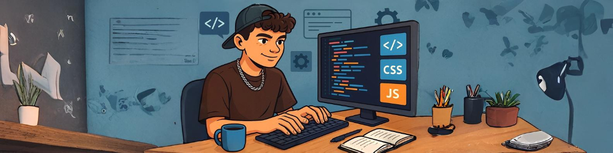

# 👋 Salut, je suis **Bastien Guitard** !

### 🧑‍🎓 Étudiant en BUT 3 - Métiers du Multimédia et de l'Internet (MMI)

Bienvenue sur mon GitHub ! Je suis actuellement étudiant à l'IUT du Limousin.

## 🌐 Mon portfolio

[Bastien GUITARD - Portfolio](https://portfolio-guitard-bastien.vercel.app/)

---

## 🧠 Stack technique

### Frontend

### Backend & Bases de données

### Outils et autres technos

---

## 🎮 Projet à la une

### [Let Him Quizz](https://github.com/bastienggg/Let_him_quizz)
Un jeu en réalité virtuelle pensé pour aider à l’apprentissage de l’anglais,  
construit avec **A-Frame**, **Three.js** et **JavaScript**.  
Une approche ludique qui relie technologie, immersion et pédagogie.

## 📫 **Me contacter**

- 💼 LinkedIn : [Bastien Guitard](https://fr.linkedin.com/in/bastien-guitard-30585329b?original_referer=https%3A%2F%2Fwww.google.com%2F)
- ✉️ Email : contact@bastienguitard.fr

---

Merci de visiter mon profil ! 🚀
