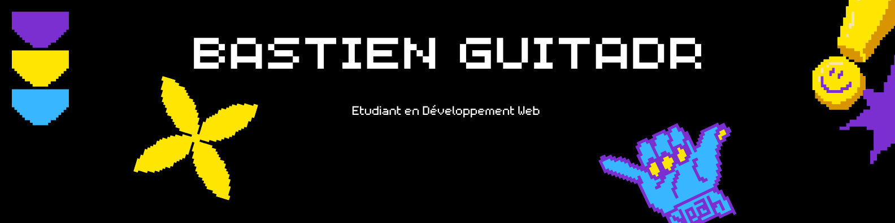

  
  
  <h1>👋 Salut, je suis <b>Bastien Guitard</b></h1>
  
  

    <b>Étudiant en BUT 2 - Métiers du Multimédia et de l'Internet (MMI)</b> 
    <i>Passionné par le développement web et la création d'expériences interactives</i>
  

  

    
    
    
  

---

## 🎓 **Parcours Académique**

  
  

### Spécialisations

- 🌐 **Développement Web Full-Stack**
- 🎨 **Création d'Interfaces Modernes**
- 📊 **Visualisation de Données**
- 🎮 **Développement d'Applications Interactives**

---

## 💻 **Stack Technologique**

  <h3>Langages & Frameworks</h3>
  
  
  
  
  
  
  
  

  <h3>Outils & Librairies</h3>
  
  
  
  

## 🛠️ **Compétences Techniques Détaillées**

### Langages de Programmation

  
  
  
  
  
  

### Frameworks & Librairies

  
  
  
  
  

### Outils de Développement

  
  
  
  

### Statistiques d'Utilisation des Technologies

  

### Niveau de Maîtrise

  <table>
    <tr>
      <td>Front-end</td>
      <td>
        
        
        
      </td>
    </tr>
    <tr>
      <td>Back-end</td>
      <td>
        
        
        
      </td>
    </tr>
    <tr>
      <td>Outils</td>
      <td>
        
        
      </td>
    </tr>
  </table>

---

## 🚀 **Projets Significatifs**

  <h3>Projets Académiques</h3>

### 📊 [SAE3.03 - Dashboard Analytique](https://github.com/bastienggg/SAE3.03)

  

### 🗺️ [SAE3.03 - Visualisation Cartographique](https://github.com/bastienggg/SAE3.03_sprint2)

  

### 🛒 [SAE3.01 - Site de Click and Collect](https://github.com/bastienggg/SAE-3.01)

  

---

## 📈 **Statistiques GitHub**

  
  
  
  

## 📊 **Activité et Contributions**

  <h3>🎓 Progression de mes études en développement</h3>
  

  <h3>📅 Contributions détaillées</h3>
  

---

  <h3>📫 Contact</h3>
  

    
    
  

  <i>Merci de visiter mon profil ! 🚀</i>

